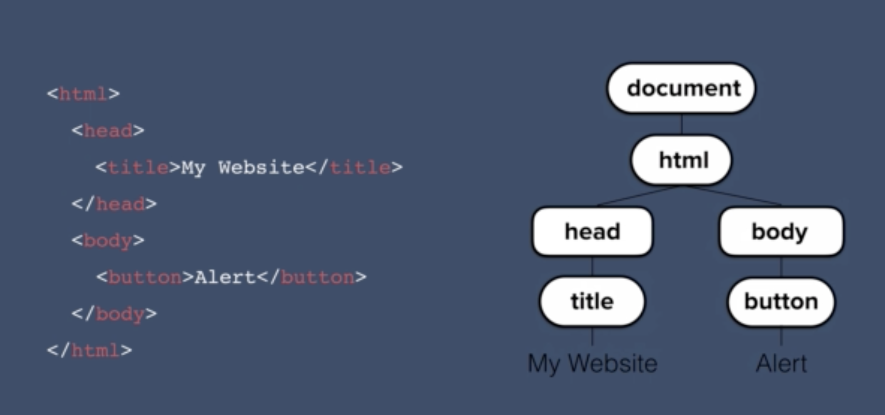

# DOM

## Adding JS to HTML
- Similar to css it can be inline, external or script
- Inline (not good)

```
<!DOCTYPE html>
<html lang="en" dir="ltr">
  <head>
    <meta charset="utf-8">
    <title></title>
  </head>
  <body onload="alert('Hello')">

  </body>
</html>
```

- Internal

```
<!DOCTYPE html>
<html lang="en" dir="ltr">
  <head>
    <meta charset="utf-8">
    <title></title>
  </head>

    <script type="text/javascript">

      alert("Hello")

    </script>

  </body>
</html>
```

- External

```
<!DOCTYPE html>
<html lang="en" dir="ltr">
  <head>
    <meta charset="utf-8">
    <title></title>
  </head>

    <script src="index.js" charset="utf-8"></script>

  </body>
</html>
```

## DOM



- HTML elements have properties and methods
- Properties can be get and set
- Methods can be triggered

## Get Elements using JS
- document.getElementsByClassName('className') returns array
- document.getElementsByTag('tagName') returns array
- document.getElementById() returns id
- document.querySelector() similar to using CSS

```
document.querySelector("li a") //returns  first anchor in the list
document.querySelector(".btn") //returns first button class
document.querySelector("h1")
```

- document.querySelectorAll() returns array


## Separation of Concerns
- It is best to use HTML for structure, CSS for styling and JS for behaviour
- One good way to do this is to add styles in CSS then toggle them using JS

```
document.querySelector().classList.add("mynewclass")
document.querySelector().classList.remove("mynewclass")
document.querySelector().classList.toggle("mynewclass")
```

## Text Manipulation
- document.querySelector("h1").innerHTML returns inner HTML regardless of element; it will also return any html like <em> as well
- document.querySelector("h1").textContent returns only the text

## Attribute Manipulation
- document.querySelector().attributes returns an array of attributes of that particular element
- document.querySelector().getAttribute() returns specific attribute
- document.querySelector().setAttribute() sets, takes 2 arguments - the attribute and the value


## Button Event Listeners

```
document.querySelector("button").addEventListener("click", handleClick);

function handleClick(){
  alert("Button has been clicked motherf****!!!!!");
}
```

It can also be an anonymous function

```
document.querySelector("button").addEventListener("click", function (){
  alert("Button has been clicked motherf****!!!!!");
})
```
