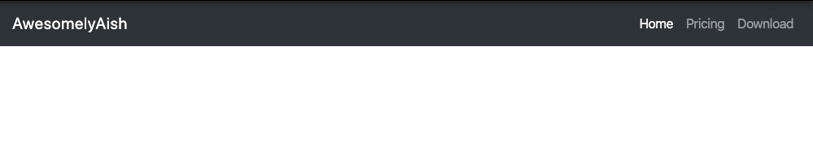
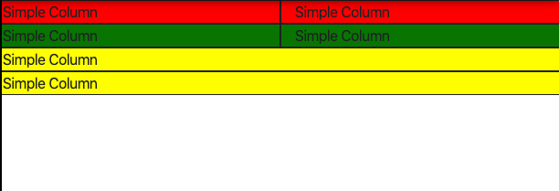
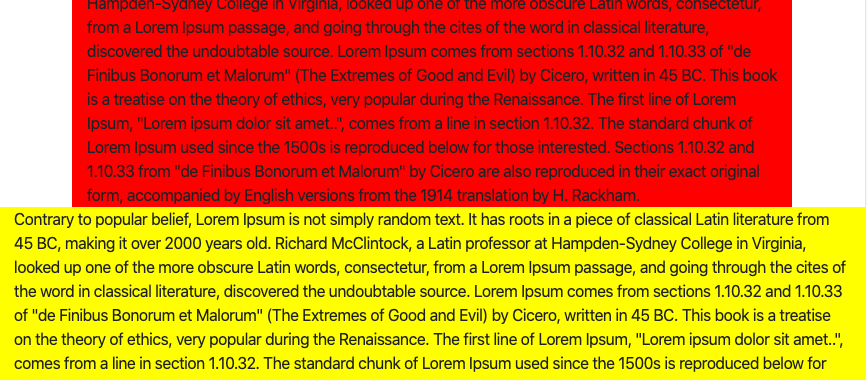

# Bootstrap
- A front-end library for re-using some of the awesome pre-written stuff
- Really good for responsive UI (responds to changing sizes of the screen)

# Installing Bootstrap
- You can add it as a link in your html file `<link rel="stylesheet" href="https://stackpath.bootstrapcdn.com/bootstrap/4.4.1/css/bootstrap.min.css" integrity="sha384-Vkoo8x4CGsO3+Hhxv8T/Q5PaXtkKtu6ug5TOeNV6gBiFeWPGFN9MuhOf23Q9Ifjh" crossorigin="anonymous">`
- You can alternative download the source code and use relative path

## Navigation  Bar

```
<nav class="navbar navbar-expand-lg navbar-dark bg-dark">
  <a class="navbar-brand" href="#">AwesomelyAish</a>
  <button class="navbar-toggler" type="button" data-toggle="collapse" data-target="#navbarTogglerDemo02" aria-controls="navbarTogglerDemo02" aria-expanded="false" aria-label="Toggle navigation">
    <span class="navbar-toggler-icon"></span>
  </button>

  <div class="collapse navbar-collapse" id="navbarTogglerDemo02">
    <ul class="navbar-nav ml-auto">
      <li class="nav-item active">
        <a class="nav-link" href="#">Home <span class="sr-only">(current)</span></a>
      </li>
      <li class="nav-item">
        <a class="nav-link" href="#">Pricing</a>
      </li>
      <li class="nav-item">
        <a class="nav-link" href="#">Download</a>
      </li>
    </ul>
  </div>
</nav>
```




## Layout
- 12 units in the row
- Simple kind

```
<div class="row">
    <div class="col" style="background-color:red; border: 1px solid">Simple Column</div>
    <div class="col" style="background-color:red; border: 1px solid">Simple Column</div>
</div>
```
- Takes up n spaces as defined by col-n

```
<div class="row">
    <div class="col-6" style="background-color:green; border: 1px solid">Simple Column</div>
    <div class="col-6" style="background-color:green; border: 1px solid">Simple Column</div>
</div>
```
- Adaptive to screen size
```
<div class="row">
    <div class="col-md-6" style="background-color:yellow; border: 1px solid">Simple Column</div>
    <div class="col-md-6" style="background-color:yellow; border: 1px solid">Simple Column</div>
</div>
```


- 4 cols on Laptop, 3 on tablet, 2 on phone

```
<div class="row">
    <div class="col-lg-3 col-md-4 col-sm-6" style="background-color:yellow; border: 1px solid">Simple Column</div>
    <div class="col-lg-3 col-md-4 col-sm-6" style="background-color:yellow; border: 1px solid">Simple Column</div>
    <div class="col-lg-3 col-md-4 col-sm-6" style="background-color:yellow; border: 1px solid">Simple Column</div>
    <div class="col-lg-3 col-md-4 col-sm-6" style="background-color:yellow; border: 1px solid">Simple Column</div>
</div>
```

## Containers
- Containers are automatically adaptive
```
<div class="container" style="background-color: red">
    Contrary to popular belief, Lorem Ipsum is not simply random text. It has roots in a piece of classical Latin literature from 45 BC, making it over 2000 years old. Richard McClintock, a Latin professor at Hampden-Sydney College in Virginia, looked up one of the more obscure Latin words, consectetur, from a Lorem Ipsum passage, and going through the cites of the word in classical literature, discovered the undoubtable source. Lorem Ipsum comes from sections 1.10.32 and 1.10.33 of "de Finibus Bonorum et Malorum" (The Extremes of Good and Evil) by Cicero, written in 45 BC. This book is a treatise on the theory of ethics, very popular during the Renaissance. The first line of Lorem Ipsum, "Lorem ipsum dolor sit amet..", comes from a line in section 1.10.32.

The standard chunk of Lorem Ipsum used since the 1500s is reproduced below for those interested. Sections 1.10.32 and 1.10.33 from "de Finibus Bonorum et Malorum" by Cicero are also reproduced in their exact original form, accompanied by English versions from the 1914 translation by H. Rackham.

</div>
```

- Fluid containers always occupy 100% of the space

```
<div class="container-fluid" style="background-color: yellow">
    Contrary to popular belief, Lorem Ipsum is not simply random text. It has roots in a piece of classical Latin literature from 45 BC, making it over 2000 years old. Richard McClintock, a Latin professor at Hampden-Sydney College in Virginia, looked up one of the more obscure Latin words, consectetur, from a Lorem Ipsum passage, and going through the cites of the word in classical literature, discovered the undoubtable source. Lorem Ipsum comes from sections 1.10.32 and 1.10.33 of "de Finibus Bonorum et Malorum" (The Extremes of Good and Evil) by Cicero, written in 45 BC. This book is a treatise on the theory of ethics, very popular during the Renaissance. The first line of Lorem Ipsum, "Lorem ipsum dolor sit amet..", comes from a line in section 1.10.32.

The standard chunk of Lorem Ipsum used since the 1500s is reproduced below for those interested. Sections 1.10.32 and 1.10.33 from "de Finibus Bonorum et Malorum" by Cicero are also reproduced in their exact original form, accompanied by English versions from the 1914 translation by H. Rackham.

</div>
```



## Buttons
- To add icons to button go to [fontawesome.ccom](fontawesome.com) or [this](https://materializecss.com/icons.html)
- Refer to bootstrap documentation for the kind of button you want

```
<button type="button" class="btn btn-dark btn-lg">Download</button>
<button type="button" class="btn btn-outline-danger btn-lg">Download</button>
```
## Carousel
- Refer to [documentation](https://getbootstrap.com/docs/4.4/components/carousel/#individual-carousel-item-interval)
- Autoplaying

```
<div id="carouselExampleSlidesOnly" class="carousel slide" data-ride="carousel">
  <div class="carousel-inner">
    <div class="carousel-item active">
        
    </div>
    <div class="carousel-item">
      
    </div>
    <div class="carousel-item">
      
    </div>
  </div>
</div>
```

- With button (remember to match href of button with id)

```
<div id="carouselExampleInterval" class="carousel slide" data-ride="carousel">
  <div class="carousel-inner">
    <div class="carousel-item active" data-interval="10000">
      
    </div>
    <div class="carousel-item" data-interval="2000">
      
    </div>
    <div class="carousel-item">
      
    </div>
  </div>
  <a class="carousel-control-prev" href="#carouselExampleInterval" role="button" data-slide="prev">
    <span class="carousel-control-prev-icon" aria-hidden="true"></span>
    <span class="sr-only">Previous</span>
  </a>
  <a class="carousel-control-next" href="#carouselExampleInterval" role="button" data-slide="next">
    <span class="carousel-control-next-icon" aria-hidden="true"></span>
    <span class="sr-only">Next</span>
  </a>
</div>
```

## Cards
- Container with image, text and button. A very commonly used element

```
<div class="container">
      <div class="card-deck mb-3 text-center">
        <div class="card mb-4 box-shadow">
          <div class="card-header">
            <h4 class="my-0 font-weight-normal">Free</h4>
          </div>
          <div class="card-body">
            <h1 class="card-title pricing-card-title">$0 <small class="text-muted">/ mo</small></h1>
            <ul class="list-unstyled mt-3 mb-4">
              <li>10 users included</li>
              <li>2 GB of storage</li>
              <li>Email support</li>
              <li>Help center access</li>
            </ul>
            <button type="button" class="btn btn-lg btn-block btn-outline-primary">Sign up for free</button>
          </div>
        </div>
      </div>
    </div>
```
