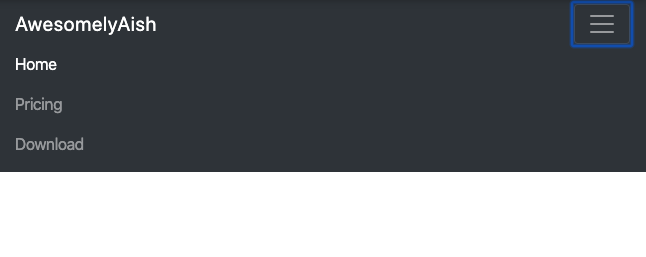

# Bootstrap
- A front-end library for re-using some of the awesome pre-written stuff
- Really good for responsive UI (responds to changing sizes of the screen)

# Installing Bootstrap
- You can add it as a link in your html file `<link rel="stylesheet" href="https://stackpath.bootstrapcdn.com/bootstrap/4.4.1/css/bootstrap.min.css" integrity="sha384-Vkoo8x4CGsO3+Hhxv8T/Q5PaXtkKtu6ug5TOeNV6gBiFeWPGFN9MuhOf23Q9Ifjh" crossorigin="anonymous">`
- You can alternative download the source code and use relative path

## Navigation  Bar
```
<nav class="navbar navbar-expand-lg navbar-dark bg-dark">
  <a class="navbar-brand" href="#">AwesomelyAish</a>
  <button class="navbar-toggler" type="button" data-toggle="collapse" data-target="#navbarTogglerDemo02" aria-controls="navbarTogglerDemo02" aria-expanded="false" aria-label="Toggle navigation">
    <span class="navbar-toggler-icon"></span>
  </button>

  <div class="collapse navbar-collapse" id="navbarTogglerDemo02">
    <ul class="navbar-nav ml-auto">
      <li class="nav-item active">
        <a class="nav-link" href="#">Home <span class="sr-only">(current)</span></a>
      </li>
      <li class="nav-item">
        <a class="nav-link" href="#">Pricing</a>
      </li>
      <li class="nav-item">
        <a class="nav-link" href="#">Download</a>
      </li>
    </ul>
  </div>
</nav>
```



